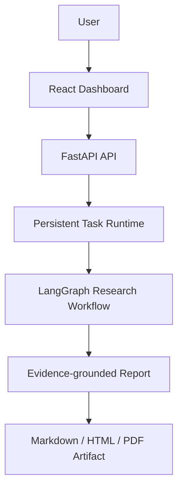
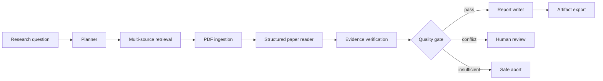

# PaperPilot AI

## Evidence-grounded Autonomous Research Agent Platform

基于 LangGraph 的证据驱动自主研究 Agent 平台。

PaperPilot 面向 AI 工程师和研究人员，将论文检索、PDF 处理、结构化阅读、证据核验、可靠任务执行与报告交付组合成一条可审计的研究流水线。项目基于 GPT Researcher 的搜索、抓取和 LLM 能力进行二次开发，同时将论文领域能力维护在独立的 `paperpilot/` 模块中。

> PaperPilot 辅助技术调研，不替代学术同行评审、原始论文阅读或专家判断。

## Overview

输入一个技术研究问题后，PaperPilot 自动完成：

- Research Planning：建立研究配置并调度确定性工作流。
- Paper Retrieval：聚合 arXiv 与 Semantic Scholar 候选论文。
- Document Processing：下载、校验并解析 PDF，保留页码和章节位置。
- Evidence Verification：核对引用位置、原文、数值一致性和语义支持关系。
- Report Generation：只基于通过核验的 Evidence 生成结构化报告。
- Artifact Delivery：安全导出 Markdown、HTML 或 PDF，并提供 SHA-256 完整性信息。

## Architecture



任务的核心执行链路如下：



更完整的模块边界、状态流和可靠性设计见 [Architecture](docs/ARCHITECTURE.md)。

## Core Features

- **Evidence-grounded reasoning**：结论必须关联经过定位和核验的 Evidence。
- **Citation verification**：校验 Evidence ID、论文归属、原文引用和 SourceLocator。
- **Conflict detection**：冲突证据不会被静默合并，可进入人工复核路径。
- **Fault-tolerant task runtime**：单论文和单数据源失败隔离，不让局部错误直接破坏整个任务。
- **Persistent execution**：任务状态、事件历史和恢复信息保存在 SQLite Runtime 中。
- **Lease-based worker coordination**：使用 lease、heartbeat、fencing token 和 execution ID 防止陈旧 Worker 覆盖结果。
- **Auditable lifecycle**：记录任务创建、排队、执行、失败、取消和租约事件。
- **Artifact generation**：安全生成 Markdown、HTML、PDF，支持原子写入和 SHA-256 校验。
- **Offline Demo Mode**：无需网络或 API Key 即可展示完整 Workflow。
- **Docker deployment**：Dashboard、API、Host 三服务共享持久化 Runtime Volume。

## Demo Mode

Demo Mode 使用 3 篇 **Synthetic Papers** 和配套 **Synthetic Evidence** 替换外部论文数据源与 LLM Provider。它仍然执行现有的检索流水线、LangGraph、质量门、报告校验和 Artifact 导出。

Demo 数据的用途是离线展示系统架构和交互流程：

- 不访问 arXiv、Semantic Scholar 或真实 LLM。
- 不需要任何 API Key。
- 不绕过 Evidence Verification 或 ReportVerifier。
- 生成结果明确标记为 synthetic demo data。
- **Demo 论文不是实际论文来源，不得作为真实学术引用。**

```powershell
poetry run paperpilot demo
```

完整说明见 [Demo Guide](docs/DEMO.md)。

## Quick Start

### Docker Compose

复制环境变量模板：

```powershell
Copy-Item .env.example .env
```

生产模式需要为所选 Provider 设置标准凭据；Demo 模式只需在 `.env` 中设置：

```env
PAPERPILOT_MODE=demo
```

启动完整系统：

```powershell
docker compose up --build
```

浏览器访问 [http://localhost](http://localhost)。SQLite Runtime 和 Artifact 保存在命名 Volume `paperpilot-data` 中。

### Local Demo

要求 Python 3.11 或更高版本：

```powershell
poetry install
poetry run paperpilot demo
```

自定义问题和输出格式：

```powershell
poetry run paperpilot demo `
  --question "YOLO与视觉SLAM融合研究进展" `
  --max-papers 3 `
  --format markdown
```

### Local Development

分别启动 Host、API 和 Dashboard：

```powershell
# Terminal 1
$env:PAPERPILOT_MODE = "demo"
poetry run paperpilot server start
```

```powershell
# Terminal 2
poetry run paperpilot-api
```

```powershell
# Terminal 3
Set-Location paperpilot-dashboard
npm install
npm run dev
```

详细环境变量、持久化路径和健康检查见 [Deployment](docs/DEPLOYMENT.md)。

## Screenshots

真实截图的约定位置如下。仓库不会用生成式图片或 Mock UI 冒充实际运行截图；发布前应按照 [截图采集规范](docs/images/README.md) 从本地 Demo Runtime 采集。

| View | Target file | Status |
| --- | --- | --- |
| Dashboard overview | `docs/images/dashboard.png` | Capture from a real local Demo run |
| Task detail and event timeline | `docs/images/task-detail.png` | Capture from a completed Demo task |
| Artifact viewer | `docs/images/artifact-viewer.png` | Capture from the verified report preview |

## Performance validation

The figures below are measured from the accepted local production baselines,
not from synthetic unit-test timing. Paper-level analysis uses bounded
concurrency with a maximum of three workers and a shared LLM limiter.

| Metric | Serial baseline | Concurrent baseline | Result |
| --- | ---: | ---: | ---: |
| End-to-end median | 20m 11s | 10m 04s | 2.01x faster |
| Paper reader median | — | — | 2.15x faster |
| Evidence verification median | — | — | 3.13x faster |
| PDF ingestion median | — | — | 0.82x (not accelerated) |

The PDF stage was deliberately not treated as a concurrency win. Source
availability, download latency, and PDF structure remain material production
variables. Detailed measurements and accepted-run criteria are recorded in
`runtime-data/evaluation/baseline-v1-r.json`,
`runtime-data/evaluation/baseline-v2.json`, and
`runtime-data/evaluation/performance-comparison.md`.

## API Overview

FastAPI 暴露任务提交、状态、事件、取消、Artifact、Metrics 和 Health 接口。公开响应不会返回研究问题正文、内部路径、Host ID、lease owner 或 fencing token。

接口摘要见 [API Overview](docs/API_OVERVIEW.md)。运行服务后可访问：

- OpenAPI JSON：`http://127.0.0.1:8000/openapi.json`
- Swagger UI：`http://127.0.0.1:8000/docs`
- Liveness：`http://127.0.0.1:8000/health/live`
- Readiness：`http://127.0.0.1:8000/health/ready`

## Design Decisions

PaperPilot 的关键选择不是简单的技术栈堆叠：

- SQLite Runtime 面向单机可部署、可检查和低运维成本场景；它不是 Redis/Celery 的等价替代。
- 单 Active Host 简化本地可靠执行模型，lease 和 fencing token 负责崩溃恢复与陈旧写入防护。
- Evidence Verification 将“模型生成内容”与“可被原文支持的结论”分开。
- Artifact-based Report 提供稳定、可下载、可校验、可长期审计的最终交付物。

完整 ADR 见 [Design Decisions](docs/DESIGN_DECISIONS.md)。

## Documentation

- [Architecture](docs/ARCHITECTURE.md)
- [Demo Guide](docs/DEMO.md)
- [Deployment](docs/DEPLOYMENT.md)
- [API Overview](docs/API_OVERVIEW.md)
- [Design Decisions](docs/DESIGN_DECISIONS.md)
- [Manual Demo Checklist](docs/demo-checklist.md)
- [Release Checklist](docs/release-checklist.md)

## Current Boundaries

- 默认部署目标是本地单机环境。
- Runtime 使用 SQLite，并采用 at-least-once execution 语义。
- 当前没有用户认证或多租户权限系统，不应直接暴露到不可信公网。
- 真实研究结果依赖论文数据源可用性、PDF 质量和 LLM Provider 输出质量。
- Evidence 验证降低无依据结论风险，但不等同于严格的同行评审。
- Demo Mode 使用合成数据，只用于展示系统流程。

## Project Lineage

PaperPilot 是基于 [GPT Researcher](https://github.com/assafelovic/gpt-researcher) 的二次开发项目，保留其底层研究能力，并增加论文领域模型、Evidence Verification、LangGraph 编排、可靠任务 Runtime、API、Dashboard 和安全 Artifact 交付层。上游版权与许可证信息见 [LICENSE](LICENSE)。
