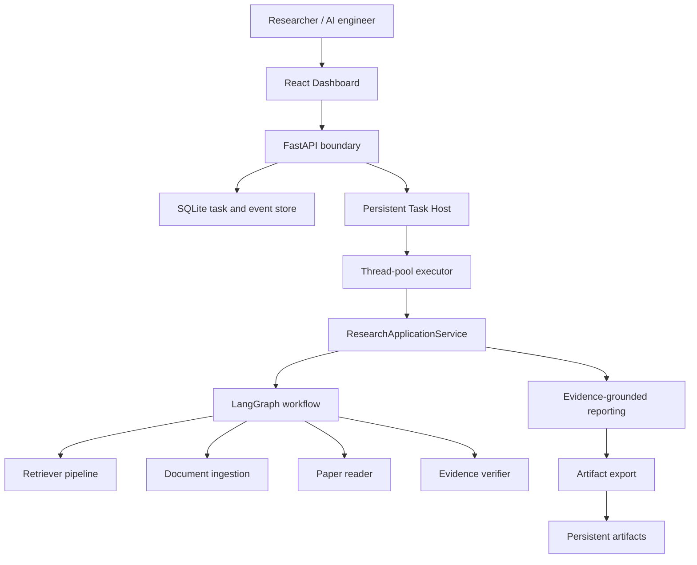
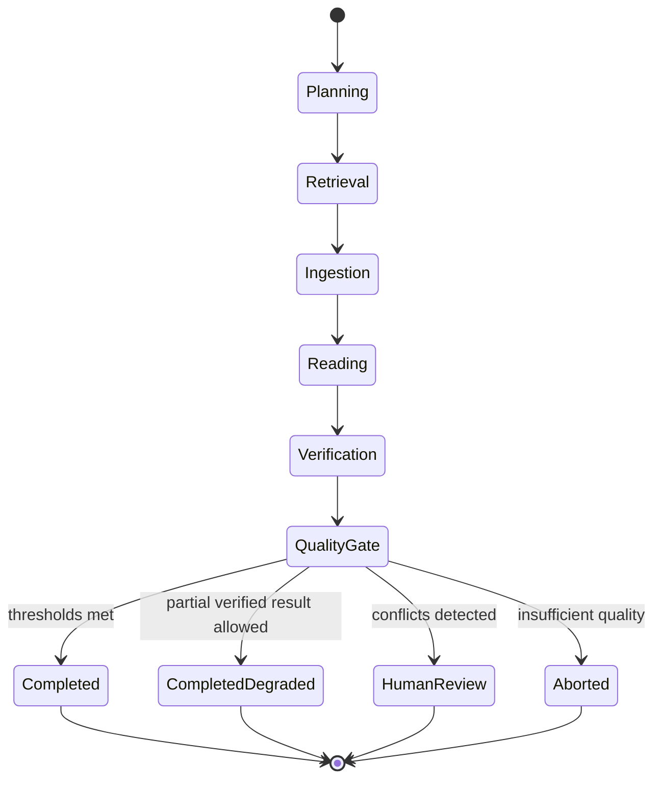
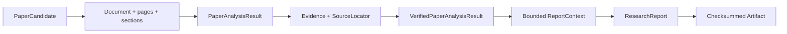

# PaperGuide Architecture

## Purpose

PaperGuide is an evidence-grounded autonomous research platform for technical literature. The architecture separates domain processing from orchestration and runtime concerns so that failures can be isolated, state can be recovered, and final reports remain auditable.

## System context

## Layer boundaries

| Layer | Responsibility | Must not own |
| --- | --- | --- |
| Dashboard | Submit tasks, display safe status/events, preview artifacts | Agent logic, secrets, report persistence |
| API | Validate public requests and expose sanitized responses | Graph construction, Worker execution |
| Runtime | Queueing, leases, heartbeat, retries, recovery, metrics | Paper analysis logic |
| Application | Coordinate Graph, report generation, export and task lifecycle | Concrete dependency creation |
| Orchestration | State transitions, nodes, routing and quality gates | Retrieval, parsing or LLM business logic |
| Domain services | Search, ingestion, reading and verification | Runtime leases or HTTP concerns |
| Reporting | Build verified context, write and verify reports | Unverified evidence |
| Export | Validate, render, checksum and atomically publish artifacts | Research decisions |

## Research workflow

Every node receives and returns a new `ResearchState`. Nodes adapt existing services; they do not recreate Retrievers, downloaders, Readers, Verifiers or Providers.

## Evidence flow

1. A Retriever returns normalized `PaperCandidate` objects.
2. The ingestion layer produces `Document` objects with stable pages and sections.
3. The Reader extracts `MethodSummary`, `ExperimentSummary` and located `Evidence`.
4. The Verifier performs deterministic quote/location checks and semantic verification.
5. Rejected or conflicted evidence is excluded from `ReportContext`.
6. The structured writer may reference only retained Evidence IDs.
7. `ReportVerifier` checks claims and citations before export.
8. `ExportVerifier` blocks unsupported claims and incomplete citations.

## Runtime reliability

The runtime uses a persistent task request, an application-visible task snapshot and append-only task events. Host coordination adds:

- Heartbeat for Active Host visibility.
- Expiring lease ownership for task claims.
- Fencing token to reject stale Worker writes.
- Stable `execution_id` per task attempt.
- Cooperative lease monitoring instead of unsafe thread termination.
- Dead-letter storage after the configured retry budget is exhausted.
- Idempotent recovery for expired leases after Host restart.
- Artifact isolation by task and execution attempt.

The execution model is at-least-once. Idempotency and fencing prevent stale attempts from publishing over a newer execution.

## Data and persistence

SQLite stores task snapshots, task requests, Host metadata, event history, schema version and dead-letter records. Report artifacts live on the filesystem under the configured export root. Docker mounts both through one named Volume so API and Host observe the same state.

No vector database, Redis, Celery, Kafka or external database is required for the current single-machine target.

## Security boundaries

- Provider credentials remain runtime environment variables and are not fields in `RuntimeSettings`.
- API responses omit questions, internal error details and local artifact paths.
- Artifact downloads are constrained to the configured artifact root.
- HTML preview uses a sandboxed iframe; Markdown rendering does not enable raw HTML.
- Logs may include task IDs, stages and durations, but not API keys, prompts or paper full text.
- The current API has no authentication and must remain local or behind a trusted gateway.

## Demo substitution

Demo Mode replaces only external boundaries: Retriever data, document acquisition, Reader, Verifier and structured Provider. It reuses the same SearchPipeline, nodes, Graph, quality gate, reporting validators, ExportService and task persistence used by the production composition.
