# PaperGuide Offline Demo

## What the demo proves

The offline demo demonstrates the complete PaperGuide execution path without network access or Provider credentials:

```mermaid
flowchart LR
    CLI["paperguide demo"] --> App["ApplicationContainer"]
    App --> Retriever["Synthetic Retriever"]
    Retriever --> Graph["Existing LangGraph"]
    Graph --> Reader["Deterministic Reader"]
    Reader --> Verifier["Deterministic Evidence Verifier"]
    Verifier --> Gate["Existing Quality Gate"]
    Gate --> Report["Structured Report + verification"]
    Report --> Artifact["Markdown / HTML / PDF"]
```



The demo does not introduce a second workflow or bypass verification.

## Data disclosure

Demo Mode uses three synthetic papers about YOLO and visual SLAM. Titles, authors, abstracts, experiments, metrics and evidence were created only for product demonstration.

They are:

- not records returned by arXiv or Semantic Scholar;
- not real academic publications;
- not evidence for a literature review;
- not suitable for citation or evaluation of actual methods.

Every generated report includes a warning that the underlying material is synthetic.

## Prerequisites

- Python 3.11 or newer.
- Project dependencies installed with Poetry.
- No API key.
- No network connection.

## Run the CLI demo

```powershell
poetry install
poetry run paperguide demo
```

Expected output is safe JSON containing a task ID, terminal status, artifact filename, warnings and `mode: demo`. It does not expose the local absolute artifact path.

Custom invocation:

```powershell
poetry run paperguide demo `
  --question "YOLO与视觉SLAM融合研究进展" `
  --max-papers 3 `
  --format markdown
```

The synthetic corpus remains fixed even if the question changes. This is intentional: the command demonstrates system execution, not open-domain research quality.

## Run Dashboard with Demo Host

Set the non-secret runtime mode before starting the long-running Host:

```powershell
$env:PAPERGUIDE_MODE = "demo"
$env:PAPERGUIDE_EXPORT_DIRECTORY = ".\runtime-data\artifacts"
poetry run paperguide server start
```

In a second terminal:

```powershell
$env:PAPERGUIDE_EXPORT_DIRECTORY = ".\runtime-data\artifacts"
poetry run paperguide-api
```

In a third terminal:

```powershell
Set-Location paperguide-dashboard
npm install
npm run dev
```

Open the Vite URL printed by the Dashboard command. Submit a research task, follow its event timeline, then preview or download the completed artifact.

## Docker demo

Create `.env` from the example and set:

```env
PAPERGUIDE_MODE=demo
```

Then run:

```powershell
docker compose up --build
```

Open [http://localhost](http://localhost). No Provider credential is required in Demo Mode.

## Interview walkthrough

1. Explain the difference between orchestration and business services.
2. Submit the built-in YOLO/SLAM topic.
3. Show the queued-to-running lifecycle and persisted event timeline.
4. Explain why synthetic evidence still passes through the real quality gate.
5. Open the report and trace a claim to its Evidence ID and locator.
6. Show SHA-256 metadata and the safe artifact download.
7. Restart the UI and confirm the task remains available from SQLite.
8. Clearly state that the dataset is synthetic and switch to production mode for real research.

Use the [manual demo checklist](demo-checklist.md) before recording or presenting the project.

## Troubleshooting

| Symptom | Check |
| --- | --- |
| CLI uses a real Provider | Confirm `paperguide demo`, or set `PAPERGUIDE_MODE=demo` for the Host |
| Dashboard reports Host unavailable | Start `paperguide server start` with the same export/runtime settings as the API |
| Artifact is not visible | Confirm API and Host share `PAPERGUIDE_EXPORT_DIRECTORY` |
| Docker data disappears | Confirm the `paperguide-data` named Volume exists |
| A report looks like a real citation | Stop the presentation and point out the synthetic-data warning |
