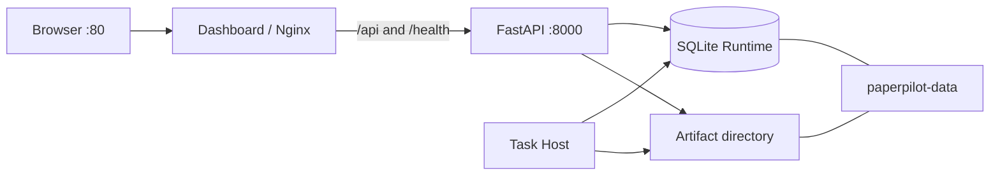

# PaperPilot Deployment

## Supported deployment profile

PaperPilot v1 targets a trusted single-machine environment. Docker Compose runs three processes while preserving a single Active Host execution model.

The API and Host images install the Debian `fonts-noto-cjk` system package.
The Survey PDF renderer uses PyMuPDF's built-in CJK face for Chinese runs and
Helvetica for Latin runs, so font binaries are not committed to the repository.



## Docker Compose quick start

```powershell
Copy-Item .env.example .env
docker compose up --build
```

Access the Dashboard at [http://localhost](http://localhost). API port 8000 is bound to loopback by default.

For an offline demonstration, set this in `.env` before startup:

```env
PAPERPILOT_MODE=demo
```

For production research, leave `PAPERPILOT_MODE=production`, select the Provider and inject its standard credential variable at runtime.

## Service responsibilities

| Service | Process | Responsibility |
| --- | --- | --- |
| `dashboard` | Nginx serving a Vite build | SPA, `/api/` reverse proxy and history fallback |
| `api` | Uvicorn/FastAPI | Public validation, safe task/status/event/artifact endpoints |
| `host` | `paperpilot server start` | Task claims, execution, recovery, Graph and Artifact generation |

The API never constructs the Graph or starts Workers. The Host is the only process that owns execution dependencies.

## Persistent volume

The named Volume `paperpilot-data` is mounted at `/app/data` by API and Host.

```text
/app/data/
├── runtime.db
├── paperpilot-runtime.sqlite3 -> runtime.db
├── artifacts/
├── logs/
└── paperpilot-downloads/
```

Removing containers does not remove the named Volume. Running `docker compose down --volumes` does remove it and should be treated as a destructive operation.

## Environment variables

| Variable | Default | Purpose |
| --- | --- | --- |
| `PAPERPILOT_MODE` | `production` | Select production or offline demo composition |
| `PAPERPILOT_LLM_PROVIDER` | `openai` | Non-secret Provider selector |
| `PAPERPILOT_MODEL_NAME` | `gpt-5.4` | Structured model name |
| `PAPERPILOT_EXPORT_DIRECTORY` | `/app/data/artifacts` in containers | Artifact root shared by Host and API |
| `PAPERPILOT_MAX_PAPERS` | `10` | Default research limit |
| `PAPERPILOT_LOG_LEVEL` | `INFO` | Standard logging threshold |
| `PAPERPILOT_API_PORT` | `8000` | Host-side API port |
| `PAPERPILOT_DASHBOARD_PORT` | `80` | Host-side Dashboard port |
| `VITE_PAPERPILOT_API_BASE_URL` | `http://localhost` | Public build-time API origin |

`RuntimeSettings` intentionally rejects secret-like `PAPERPILOT_*` names. Provider credentials must use the Provider's standard runtime environment variables. Never bake credentials into an image, Vite variable, Compose file or README.

## Health checks

- Dashboard: `GET /healthz` on Nginx.
- API liveness: `GET /health/live`.
- API readiness: `GET /health/ready`.
- Host: persistent heartbeat checked against the shared SQLite Runtime.

Liveness means the process responds. Readiness additionally depends on the Host heartbeat, schema and writable artifact storage.

## Local three-terminal deployment

```powershell
# Terminal 1: worker host
poetry run paperpilot server start
```

```powershell
# Terminal 2: API
poetry run paperpilot-api
```

```powershell
# Terminal 3: Dashboard
Set-Location paperpilot-dashboard
npm install
npm run dev
```

All Python processes must use the same `PAPERPILOT_EXPORT_DIRECTORY`; this also determines the shared SQLite Runtime location.

## Operational checks

```powershell
docker compose config
docker compose ps
docker compose logs api host dashboard
```

Logs may be inspected for task IDs, status and duration. Do not enable logging of prompts, Provider responses, credentials or complete paper text.

## Current limitations

- Local single-machine deployment only.
- SQLite is not intended for high-write distributed clusters.
- One Active Host coordinates execution.
- At-least-once execution requires idempotent artifacts and fenced result writes.
- No built-in authentication or TLS termination.
- No Redis, Celery, Kubernetes or external database integration.

For Internet-facing deployment, place the system behind authenticated TLS ingress and complete a separate threat model before use.
