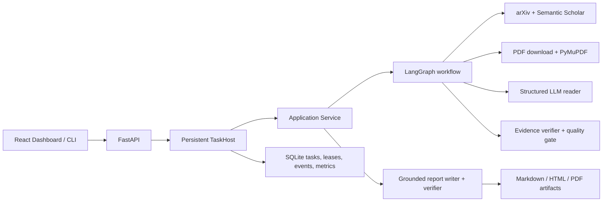

# PaperGuide AI v1.0

Evidence-grounded Deep Research Agent for technical literature.

PaperGuide turns a technical question into a traceable literature report. It retrieves papers from arXiv and Semantic Scholar, validates downloaded PDFs, extracts page and section text, asks a structured LLM to analyse methods and experiments, verifies evidence, and exports an auditable report.

## Core capabilities

- Multi-source retrieval and metadata deduplication
- PDF validation, parsing, and deterministic section detection
- Structured paper reading and evidence mapping
- Evidence verification and conflict detection
- LangGraph orchestration with deterministic quality gates
- SQLite-backed reliable local task runtime
- Evidence-grounded Markdown, HTML, and PDF reports
- FastAPI and React research dashboard

## Architecture



The full data flow is:

`ResearchRequest → ResearchState → PaperCandidate[] → Document[] → PaperAnalysisResult[] → VerifiedPaperAnalysisResult[] → ResearchReport → ArtifactMetadata`.

## Local development environment

Requirements:

- Python 3.11 or newer (the repository declares `>=3.11`)
- Poetry 1.8 or newer
- Node.js 18.18 or newer
- A PDF-capable Python environment with PyMuPDF; PDF export also requires the project's configured renderer stack

Windows PowerShell setup:

```powershell
py -3.11 -m venv .venv
.\.venv\Scripts\Activate.ps1
python -m pip install --upgrade pip
python -m pip install poetry
poetry install
Copy-Item .env.example .env

Set-Location paperguide-dashboard
npm install
Set-Location ..
```

Edit `.env` and set non-sensitive `PAPERGUIDE_*` values. Set the provider credential using GPT Researcher's existing standard variable, for example `OPENAI_API_KEY`; PaperGuide settings intentionally reject secret-like fields.

## Three-terminal startup

From the repository root with the Python environment activated:

Terminal 1 — persistent host:

```powershell
poetry run paperguide server start
```

Terminal 2 — API:

```powershell
poetry run paperguide-api
```

Terminal 3 — dashboard:

```powershell
Set-Location paperguide-dashboard
npm run dev
```

The API binds to `127.0.0.1:8000`; Vite prints the dashboard URL. The export directory contains artifacts. Its parent contains `paperguide-runtime.sqlite3` and `paperguide-downloads`, so use a dedicated runtime-data parent and back it up as one unit.

## Provider configuration

```dotenv
PAPERGUIDE_LLM_PROVIDER=openai
PAPERGUIDE_MODEL_NAME=gpt-5.4
PAPERGUIDE_EXPORT_DIRECTORY=./runtime-data/artifacts
OPENAI_API_KEY=<set-locally-only>
```

Semantic Scholar works without a key for basic search; `SEMANTIC_SCHOLAR_API_KEY` is optional. arXiv does not require a key. Never commit `.env`, provider responses, prompts, or PDF text.

## Minimal real smoke test

The smoke command is a single explicit run: it performs no retries and defaults to one arXiv paper and Markdown.

```powershell
poetry run python -m paperguide.smoke `
  --question "What methods combine YOLO with visual SLAM?" `
  --max-papers 1 `
  --format markdown `
  --output-directory .\runtime-data\smoke
```

It writes `smoke-result.json` with a question hash, stage timings, counts, a safe artifact basename, and redacted diagnostics. It does not write the question, prompts, PDF text, raw provider responses, credentials, or absolute artifact paths.

## Dashboard flow

Open the runtime health view, submit a question, follow the task detail timeline through queued/running/terminal status, then download the completed artifact. Refresh the detail page to confirm persistence and stop TaskHost to confirm readiness becomes unavailable. The complete manual procedure is in [demo-checklist.md](demo-checklist.md).

## Verification

Offline tests must be the default. Real network/LLM checks are manual and must never be represented by Fake-provider unit tests. Recommended release commands are listed in [release-checklist.md](release-checklist.md).

## Security boundary

- Credentials are loaded by provider libraries from their standard environment variables and are not part of `RuntimeSettings`.
- Diagnostics redact secret assignments and local paths and never retain questions or full paper content.
- Artifact filenames are reduced to safe basenames in CLI/API/diagnostic output.
- SQLite and artifacts are local files; filesystem permissions are the deployment security boundary.
- The v1 API has no authentication and must not be exposed directly to untrusted networks.

## Current limitations

- Default deployment is a local, single-machine system.
- Task coordination uses SQLite.
- Execution is at-least-once; fencing tokens and artifact execution IDs protect stale writes and duplicate exports.
- There is no user authentication or authorization.
- Result quality and availability depend on paper sources, PDF quality, and the selected LLM provider.
- Evidence verification improves traceability but is not a substitute for academic peer review.
- Product version metadata is not yet unified: the inherited Python distribution, API milestone, and dashboard package currently use separate version schemes. This is a v1.0 release blocker, not hidden by the demo documentation.

## Short v2 direction

After v1 validation, the next release should focus on authenticated deployment, supported database migration beyond local SQLite, and provider-quality evaluation—not additional agents.
